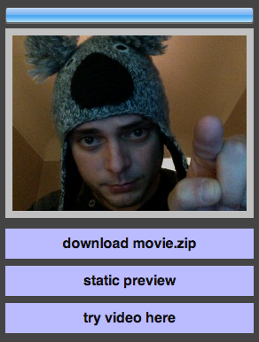

[Vine](http://vine.co) for the Web? Sure: **Wine**! Highly experimental, partially unusable, totally awesome!

### Setup
In order to have a proper test environment there are few things needed.

The very first one, open your terminal and go to your kick-ass folder where you have your nerdy stuff, done? Good!

    git clone git://github.com/WebReflection/wine.git
    cd wine
    mkdir -p video
    mkdir -p node_modules
    npm install experimental
    npm install polpetta

If you want this test to be reachable via Wi-Fi or network, you need to manual hack polpetta, as a quick way to create the host in `0.0.0.0` rather than `127.0.0.1`.

In order to do this, edit with any text editor the file `node_modules/polpetta/build/polpetta` and change the line

    HOST_NAME = process.env.IP || "127.0.0.1",
    
into the line

    HOST_NAME = process.env.IP || "0.0.0.0",

Save it, simply type `polpetta` or `node node_modules/polpetta/build/polpetta` in your terminal and check that you have something like this as output:

    http://0.0.0.0:1337/
    # (က) polpetta v0.3.4 /Users/yourname/kick-ass-folder/

Now `ctrl+c` to close *polpetta* for now, since there's much more to install for the awesome **[ffmpeg](http://ffmpeg.org)** software!

If you are using [Home Brew](http://mxcl.github.com/homebrew/) you just have to do following steps, otherwise you need to check here [how to build or other options](http://ffmpeg.org/download.html).

    brew install automake celt faac fdk-aac git lame libass libtool libvorbis libvpx \
    libvo-aacenc opencore-amr openjpeg opus sdl schroedinger shtool speex texi2html \
    theora wget x264 xvid yasm

#### ffmpeg
One call this stuff has been installed, it's time to choose what you really want to do:

  * just test this bloody thingy
  * considering to do more with **ffmpeg** later on

It doesn't matter! I had actually so many troubles trying to shrink dependencies that I ended up including everything!

    brew install ffmpeg --with-tools --with-openssl --with-openjpeg --with-libass --with-opus
                        --with-opencore-amr --with-freetype --with-schroedinger --with-ffplay
                        --with-rtmpdump --with-theora --with-libvorbis --with-fdk-aac
                        --with-libvo-aacenc --with-libvpx

If you compiled manually, this would be a proper list of arguments:

    brew install ffmpeg --enable-libx264 --enable-libfaac --enable-libmp3lame --enable-libxvi 
                        --enable-libfreetype --enable-libtheora --enable-libvorbis --enable-libvpx
                        --enable-librtmp --enable-libopencore-amrnb --enable-libvo-aacenc
                        --enable-libass --enable-ffplay --enable-libspeex --enable-libschroedinger
                        --enable-libfdk-aac --enable-openssl --enable-libopus

While in theory, in my opinion, this should be enough!

    brew install ffmpeg --enable-libx264 --enable-libtheora --enable-libvorbis --enable-libvpx

Feel free to waste time figuring out the bare necessities for this and I'll be happy to update this page.

However, [this page has been helpful](http://ffmpeg.org/trac/ffmpeg/wiki/MacOSXCompilationGuide), but I am sure you won't need it ;-)

#### gifsicle
This is the last dependency we need to have the whole environment ready to do funny things for us.

    brew install gifsicle

Or you can go [directly in the main page](http://www.lcdf.org/gifsicle/) and try your way to install it.

#### Ready, Set, GO!
If everything has been installed successfully, it's time to write in your terminal 2 more things:

    ifconfig
    polpetta

The reason `ifconfig` is there is that you might want to know the current network IP address in order to test from a device via Wi-Fi connection and with **Opera Mobile** browser or, from Desktop, with **Chrome Canary**, **Firefox Nightly** or **Opera Next** again.

These work, more or less, where *less* means that final result might be without the audio.

Reach `http://0.0.0.0:1337/` page and enjoy this absolutely experimental [Vine](http://vine.co) like application for Web: **Wine**

### License
This repository is under Mit Style license:

    Copyright (C) 2013 by Andrea Giammarchi, @WebReflection

    Permission is hereby granted, free of charge, to any person obtaining a copy
    of this software and associated documentation files (the "Software"), to deal
    in the Software without restriction, including without limitation the rights
    to use, copy, modify, merge, publish, distribute, sublicense, and/or sell
    copies of the Software, and to permit persons to whom the Software is
    furnished to do so, subject to the following conditions:

    The above copyright notice and this permission notice shall be included in
    all copies or substantial portions of the Software.

    THE SOFTWARE IS PROVIDED "AS IS", WITHOUT WARRANTY OF ANY KIND, EXPRESS OR
    IMPLIED, INCLUDING BUT NOT LIMITED TO THE WARRANTIES OF MERCHANTABILITY,
    FITNESS FOR A PARTICULAR PURPOSE AND NONINFRINGEMENT. IN NO EVENT SHALL THE
    AUTHORS OR COPYRIGHT HOLDERS BE LIABLE FOR ANY CLAIM, DAMAGES OR OTHER
    LIABILITY, WHETHER IN AN ACTION OF CONTRACT, TORT OR OTHERWISE, ARISING FROM,
    OUT OF OR IN CONNECTION WITH THE SOFTWARE OR THE USE OR OTHER DEALINGS IN
    THE SOFTWARE.

The Recordjs project is developed by [mattdiamond](https://github.com/mattdiamond).

You will find details about ffmpeg and gifsicle license in respective pages.